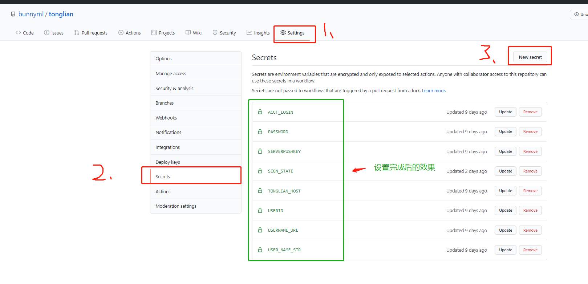
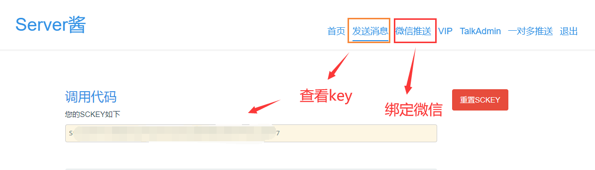
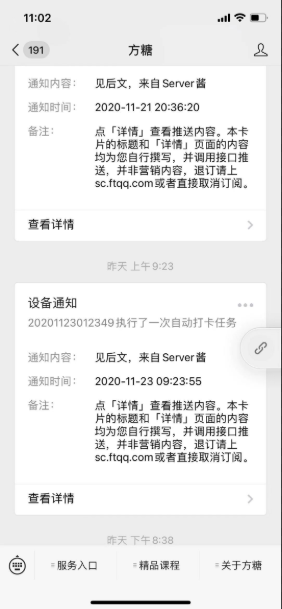

# 简介
本仓库可以通过GitHub Actions 查询同联每日考勤打卡记录，如果超出规定时间还没打卡，则自动执行一次打卡
目前定时任务会在以下两个时间执行一次：  
  - UTC时间凌晨1点也就是北京时间早上9点15分左右
  - UTC时间中午13点也就是北京时间晚上9点15分左右

执行完自动打卡任务后，会通过微信发送一条推送消息(需要配置SERVERPUSHKEY才可以)

## 使用方法

>设置以下几个Secrets
- TONGLIAN_HOST  设置固定值为  152.136.204.187
- USERID  设置为自己的userId
- ACCT_LOGIN 设置为 自己的账号
- PASSWORD 设置为自己的密码
- USERNAME_URL 设置为自己的名字 需要使用URL编码网址是https://tool.chinaz.com/tools/urlencode.aspx
- USER_NAME_STR 设置为自己的名字，这里是中文，不需要转码
- SERVERPUSHKEY 微信推送key
- SIGN_STATE 1:执行打卡任务  2:不执行打卡任务

**secrets设置截图**

## 微信订阅执行结果设置

1. 前往[sc.ftqq.com](http://sc.ftqq.com/3.version)创建账号，并且生成一个Key。将其增加到Github Secrets中，变量名为`SERVERPUSHKEY`，值为你创建账号获得的key,可在[查看Key](http://sc.ftqq.com/?c=code),查看你的key。
2. 绑定微信账号，开启微信推送。[绑定微信](http://sc.ftqq.com/?c=wechat&a=bind)

3. 推送效果展示

